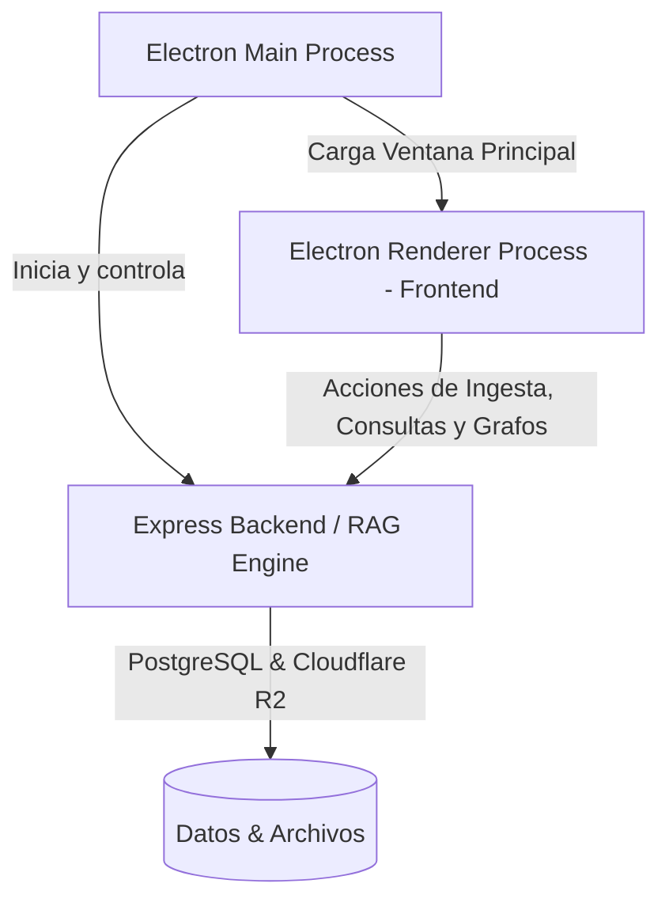

# Plan de Integración: Aplicación de Escritorio RAG con Visualización de Nodos Dinámica

Este plan detalla cómo transformar y complementar el backend RAG actual para ofrecer una **aplicación de escritorio nativa para PC** con un panel de control de archivos y un diagrama interactivo de relaciones basado en grafos (nodos de documentos y fragmentos/párrafos) que reacciona dinámicamente a las búsquedas.

---

## 🏗️ Arquitectura de la Aplicación de Escritorio

Utilizaremos **Electron** como framework principal para envolver la aplicación. Esto nos permite:
1. Mantener toda la base de código actual en TypeScript/Node.js.
2. Levantar el motor de base de datos PostgreSQL/R2 de manera transparente.
3. Crear una interfaz gráfica fluida usando tecnologías web modernas con rendimiento nativo de escritorio.
4. Renderizar gráficos de red de alto rendimiento usando librerías especializadas como **Vis.js Network** o **Cytoscape.js**.

---

## 🎨 Diseño y Distribución de la Ventana (UI/UX)

La aplicación contará con un diseño premium en modo oscuro con distribución de pantalla dividida (Split Pane):

### 1. Panel Izquierdo: Gestión de Documentos
* **Carga de Archivos:** Zona de arrastrar y soltar (Drag & Drop) intuitiva.
* **Tabla Estructurada:**
  * Lista paginada de documentos con nombre, formato (PDF, DOCX, TXT, MD), tamaño, fecha de carga y cantidad de fragmentos.
  * Acciones rápidas: Eliminar (elimina de PostgreSQL, R2 y del grafo de nodos).

### 2. Panel Derecho: Diagrama de Relaciones e Interactividad (Grafo de Nodos)
Un lienzo interactivo que representa la estructura semántica de tus documentos:
* **Nodos de Documento (Padres):** Círculos grandes de un color distintivo (ej. Azul/Cian vibrante).
* **Nodos de Fragmento (Hijos):** Círculos más pequeños interconectados a su documento correspondiente.
* **Interacciones:**
  * **Hover/Click:** Muestra el contenido del fragmento de texto o los metadatos del documento.
  * **Zoom y Pan:** Navegación fluida en el lienzo de grafos.
* **Comportamiento Dinámico ante Consultas (Chat/Input):**
  * El usuario escribe una consulta RAG en la barra inferior.
  * Al realizar la búsqueda, el sistema calcula la similitud coseno (distancia semántica) de cada fragmento con la consulta.
  * **Ajuste visual en tiempo real:**
    * Los fragmentos con **mayor relevancia (menor distancia)** aumentan de tamaño, brillan intensamente (animación de pulso) y se acercan al centro de atracción visual de la consulta.
    * Los fragmentos irrelevantes se desvanecen (opacidad reducida) o se ocultan temporalmente para limpiar el ruido visual.

---

## 🛠️ Plan de Implementación paso a paso

### Paso 1: Configurar dependencias de Electron
Instalar Electron y configurar los scripts en `package.json` para ejecutar la ventana de escritorio.
* Dependencias clave: `electron`, `vis-network` (para renderizar los nodos de forma fluida).

### Paso 2: Crear el Archivo Principal de Electron (`main.ts` / `main.js`)
Establecer el ciclo de vida de la ventana, deshabilitar menús innecesarios y configurar el puente IPC (Inter-Process Communication) o redirigir al backend local.

### Paso 3: Desarrollar la Interfaz de Usuario (Vista Principal)
Crear la estructura HTML/CSS/JS del frontend:
* Estructurar el layout con Flexbox/Grid en dos columnas principales.
* Integrar `vis-network` para inicializar el grafo con los documentos de la base de datos.

### Paso 4: Lógica del Grafo Dinámico (Interconectividad)
* **Ingesta inicial:** Cargar todos los documentos y fragmentos de la base de datos al iniciar la ventana para mapear el grafo.
* **Actualización en consulta:** Modificar el endpoint `/api/query` para que devuelva no solo la respuesta en texto, sino también las puntuaciones de similitud (distancias) de todos los fragmentos comparados. El frontend usará estas puntuaciones para redimensionar y colorear los nodos en tiempo real.

---

## ⚡ Requisitos Técnicos para Llevar a otra PC

Al ser empaquetada como App de Escritorio:
1. El usuario solo requerirá ejecutar la aplicación.
2. La base de datos PostgreSQL debe ser accesible (ya sea local en esa PC o remota en la nube configurada en el `.env`).
