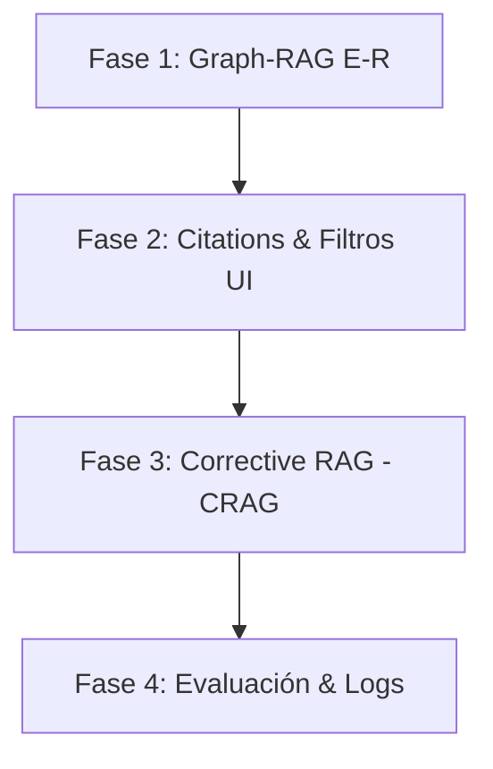

# Plan de Integración: Mejoras Avanzadas para RAG Studio

Este documento detalla la planificación técnica paso a paso para integrar capacidades de **Graph-RAG real**, **Filtros por Metadatos**, **Citas Interactivas (Citations)**, y **RAG Correctivo (CRAG)** en el sistema actual.

---

## 🗺️ Mapa de Ruta (Roadmap) de Implementación



---

## 🛠️ Detalle de Fases y Tareas

### Fase 1: Graph-RAG (Extracción de Entidades y Relaciones)
* **Objetivo**: Pasar de similitud puramente vectorial a un grafo de conocimiento estructurado.

#### 1. SQL Schema Update
Crear la tabla para almacenar el grafo de entidades y relaciones.
```sql
CREATE TABLE document_entities (
  id UUID PRIMARY KEY DEFAULT gen_random_uuid(),
  document_id UUID REFERENCES documents(id) ON DELETE CASCADE,
  paragraph_id UUID REFERENCES document_paragraphs(id) ON DELETE CASCADE,
  entity_name TEXT NOT NULL,
  entity_type VARCHAR(100) NOT NULL, -- ej: Persona, Lugar, Organización, Concepto
  created_at TIMESTAMP WITH TIME ZONE DEFAULT NOW()
);

CREATE TABLE entity_relations (
  id UUID PRIMARY KEY DEFAULT gen_random_uuid(),
  source_entity_id UUID REFERENCES document_entities(id) ON DELETE CASCADE,
  target_entity_id UUID REFERENCES document_entities(id) ON DELETE CASCADE,
  relation_type TEXT NOT NULL, -- ej: "desarrolla", "pertenece a", "es parte de"
  context_paragraph_id UUID REFERENCES document_paragraphs(id) ON DELETE CASCADE
);
```

#### 2. Ingesta Asistida por LLM (`src/services/entityExtractionService.ts`)
Durante el pipeline de ingesta (`IngestionPipeline`), llamar a un prompt de extracción para identificar entidades y cómo se relacionan entre sí a partir del fragmento contextualizado.

---

### Fase 2: Interactividad en la UI (Citations & Filtros)
* **Objetivo**: Conectar el Chat RAG con el Grafo de Relaciones y el Explorador Jerárquico.

#### 1. Formateo de Citaciones en la Respuesta
Modificar `src/services/openCodeService.ts` en `generateRAGAnswer` para forzar al LLM a devolver citas referenciando IDs de fragmentos específicos en formato markdown (ej. `[1](fragment-uuid)`).

#### 2. Eventos interactivos en el frontend (`public/app.js`)
* Analizar los enlaces de fragmentos `[1](fragment-uuid)` en el HTML generado del chat.
* Agregarles un listener que al hacer click:
  1. Cambie de pestaña a **Grafo de Relaciones** o **Explorador**.
  2. Ejecute `window.focusNodeInGraph('frag-uuid')` para centrar y resaltar visualmente la fuente del dato.

#### 3. Filtros en la Barra Lateral
* Permitir filtrar los documentos por extensión, fecha o categoría desde el panel izquierdo.
* Propagar estos filtros en las peticiones a `/api/query` para reducir el espacio de búsqueda semántica.

---

### Fase 3: RAG Correctivo (CRAG) & Agentic Loop
* **Objetivo**: Evaluar la relevancia del contexto antes de responder y auto-corregir.

#### 1. Evaluador de Relevancia (`src/services/relevanceEvaluator.ts`)
Antes de enviar el contexto al LLM generador:
1. Pasar los fragmentos recuperados a un LLM evaluador con la pregunta original.
2. Determinar si la información provista es: `RELEVANTE`, `PARCIAL`, o `IRRELEVANTE`.

#### 2. Rutas alternativas en `src/services/iterativeRAGEngine.ts`
* **Si es RELEVANTE**: Proceder con la generación estándar.
* **Si es PARCIAL/IRRELEVANTE**:
  * Utilizar el LLM para reformular o ampliar la consulta original.
  * Realizar una segunda búsqueda con la nueva consulta (búsqueda iterativa expandida).
  * Si persiste la duda, indicar explícitamente qué información falta en lugar de alucinar.

---

### Fase 4: Evaluación y Calidad (Ragas Backend)
* **Objetivo**: Medir la fidelidad de las respuestas automáticamente.

#### 1. Base de Datos de Métricas
```sql
CREATE TABLE query_evaluations (
  id UUID PRIMARY KEY DEFAULT gen_random_uuid(),
  query_text TEXT NOT NULL,
  answer_text TEXT NOT NULL,
  faithfulness_score NUMERIC(3, 2), -- Fidelidad al contexto (0.00 a 1.00)
  answer_relevance_score NUMERIC(3, 2), -- Relevancia de la respuesta al usuario (0.00 a 1.00)
  created_at TIMESTAMP WITH TIME ZONE DEFAULT NOW()
);
```

#### 2. Pipeline de Evaluación
Al finalizar cada consulta RAG, correr en segundo plano un proceso ligero donde el LLM califique la respuesta generada con respecto al contexto recuperado para generar estadísticas de calidad del sistema.
