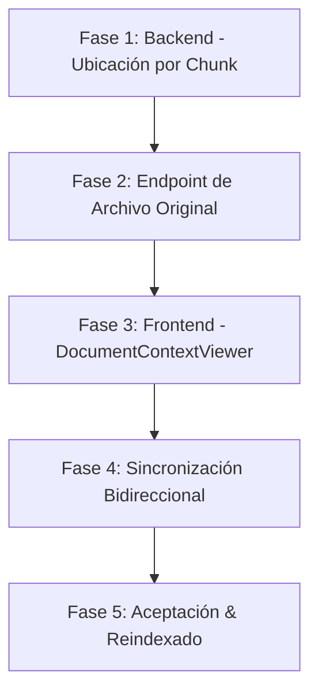

# Plan de Integración: Interactive Document & Chunk Viewer

Módulo de visualización sincronizada bidireccionalmente entre la interfaz de Grafo/Partículas (Chunks) y la Vista Completa del Documento Fuente (`log.md` → spec). El sistema debe saltar desde cualquier nodo/chunk del grafo a la ubicación exacta del fragmento en el documento original (highlight + scroll automático) y conservar el contexto completo (lectura previa y posterior).

---

## 🗺️ Mapa de Ruta



---

## Estado base relevante (código actual)

| Área | Archivo | Punto de integración |
|------|---------|----------------------|
| Chunking (texto) | `src/services/chunkingService.ts:247` | `splitHierarchical()` sin offsets de ubicación |
| Extracción PDF | `src/services/chunkingService.ts:148` | `extractPDF()` aplana texto sin página/posición |
| Persistencia de chunk | `src/services/ingestionPipeline.ts:95-109` | `metadata` JSONB solo con `{ keywords, category }` |
| Storage del binario | `src/services/r2Service.ts:63` | Guarda el original (R2 o `data/documents/`) pero **no se sirve** |
| Rutas documentos | `src/routes/documents.ts` | Solo upload/list/delete/paragraphs; falta servir el archivo |
| Grafo → click | `public/app.js:329` | `network.on('click')` solo rellena `node-detail` |
| Enfoque de nodo | `public/app.js:638` | `focusNodeInGraph()` y chips de citas (`app.js:946`) → ancla para abrir visor |
| Layout | `public/index.html` | sin contenedor/modal de visor; CSP ya permite `unpkg.com` |

---

## Fase 1 — Backend: ubicación por chunk

### 1.1 Tipos `DocumentChunkMetadata`
Reflejar el esquema de `log.md` en `chunkingService.ts`:

```ts
export interface ChunkLocation {
  pageNumber?: number;
  startChar?: number;
  endChar?: number;
  startLine?: number;
  endLine?: number;
  boundingBoxes?: Array<{ x: number; y: number; width: number; height: number }>;
}

export interface ChildChunk {
  text: string;
  childIndex: number;
  parentIndex: number;
  location: ChunkLocation;
}
```

### 1.2 Offsets en texto / Markdown / código
- En `splitHierarchical()`/`splitBySize()`, arrastrar `startChar/endChar/startLine/endLine` calculados sobre el **texto original sin normalizar** (evitar desviación por `trim`/`join('\n\n')`).
- Mantener contadores de carácter y de línea mientras se rebanan los fragments.

### 1.3 Posición en PDF (mayor esfuerzo)
- Sustituir el aplanado de `extractPDF()` (`chunkingService.ts:148`) por extracción por página + posición usando **pdfjs-dist** con el text layer:
  - Lectura página a página: `pageNumber` (1-indexed).
  - Para cada fragmento de texto, calcular `boundingBoxes` en coordenadas normalizadas `[0,1]` (x,y,w,h) desde los items de la text layer.
  - Conservar el fallback OCR (`extractPDFWithOCR`, line 173) para PDF escaneados, en cuyo caso solo queda `pageNumber`.

### 1.4 Persistencia en DB
- En `ingestionPipeline.ts:95-109`, escribir `{ keywords, category, location }` en `metadata`.
- Nueva migración `src/migrations/006_chunk_locations.sql` (no cambia columnas; documenta el nuevo shape de `metadata`).

---

## Fase 2 — Endpoint del archivo original

### 2.1 Ruta `GET /api/documents/:id/file`
En `src/routes/documents.ts`:
- Resolver el `r2_key` del documento.
- Modo local (`r2Service.ts`): servir el buffer con `fs.readFileSync`.
- Modo R2: `GetObject` para traer el binario.
- Setear `Content-Type` según `mime_type` y enviarlo al frontend (necesario para pdf.js y para el visor de texto).

### 2.2 Incluir `location` en paragraphs
Ampliar la query de `GET /api/documents/:id/paragraphs` (`documents.ts:119`) para exponer `location` desde `metadata`, de modo que el frontend no necesite una llamada extra.

---

## Fase 3 — Frontend: `DocumentContextViewer`

### 3.1 Contenedor en `index.html`
- Agregar un modal o panel lateral `DocumentContextViewer` (con nuevas clases en `style.css`).
- Entradas: `docId`, `targetChunkLocation`, `onSelectionChange`.

### 3.2 `PDFAdapter`
- Cargar **pdfjs-dist** (CSP ya permite `unpkg.com`).
- Renderizar a Canvas con text layer activada (`renderTextLayer`).
- Highlight: overlays `<div>` posicionados sobre los `boundingBoxes` de la página objetivo (o plugin de highlights).
- Scroll: `jumpToPage(pageNumber)` + scroll suave hacia el bbox.

### 3.3 `TextCodeAdapter`
- Usar **Monaco (`@monaco-editor/react`)** o **CodeMirror 6** en modo `readOnly`.
- Highlight: `createDecorationsCollection` / `EditorView.decorations` para el rango `startLine/endLine`/`startChar/endChar`.
- Scroll: `revealRangeInCenter({ startLineNumber, startColumn, endLineNumber, endColumn })`.

### 3.4 Animación de focalización
- Pulso CSS temporal (destello amarillo/azul ~1.5 s) al llegar la posición objetivo.

---

## Fase 4 — Sincronización bidireccional

### 4.1 Grafo → Documento (navegación al contexto)
- En `network.on('click')` (`app.js:329`) y en `focusNodeInGraph()` (`app.js:638`):
  - Emitir el `location` del nodo al `DocumentContextViewer`.
  - Abrir la vista si no estaba visible.
  - Scroll automático + decoración de highlight, sin bloquear el scroll libre del usuario.

### 4.2 Documento → Grafo / Búsqueda semántica
- Capturar selección nativa en el visor (`window.getSelection()` o eventos de Monaco/PDF.js).
- Desplegar menú contextual flotante («Buscar similitud en el grafo» / «Crear relación»).
- Disparar `POST /api/query/scores` (`query.ts:85`) con el texto seleccionado y resaltar los nodos (reutilizando la lógica de `runGraphQuery`, `app.js:730`).

---

## Fase 5 — Criterios de aceptación (de `log.md`)
- [x] El chunking persiste `pageNumber/boundingBoxes` para PDFs y `startChar/endChar` para texto/código.
- [ ] Al hacer clic en una partícula del grafo, el documento se abre en la página/línea exacta en < 300 ms. *(implementado; pendiente validar latencia con DB y datos reales)*
- [x] El fragmento objetivo aparece resaltado con animación sutil.
- [x] Scroll infinito/libre dentro del documento para leer contexto antes y después del fragmento.
- [x] La selección de texto libre dentro del visor emite el fragmento seleccionado para búsquedas/resaltados secundarios.

---

## ✅ Progreso (implementado)

Fases 1–4 completadas:

- **Backend**: `ChunkingService` ahora genera `location` (`startChar/endChar/startLine/endLine` siempre; `pageNumber` y `boundingBoxes` normalizados para PDF vía `pdfjs-dist`). `IngestionPipeline` persiste `location` en `metadata`. Migración `006_chunk_locations.sql`. Nuevo endpoint `GET /api/documents/:id/file` (`r2Service.readFile`). `GET /api/documents/:id/paragraphs` expone `location`.
- **Frontend**: nuevo `public/viewer.js` (`DocumentContextViewer` + `PDFAdapter` con pdf.js y `TextCodeAdapter` en vista de líneas), modal en `index.html`, estilos en `style.css`. Sincronización Grafo→Documento en `app.js` (`network.on('click')` y `focusNodeInGraph`) y Documento→Grafo (`searchGraphForText` + menú de selección).
- **Validación**: `npm run build` ✓; unit tests de chunking ✓ (9); servidor arranca y registra rutas ✓; probe real sobre `.txt` y `.pdf` del repo confirma offsets/página/bbox ✓.
- **Nota**: las 4 fallas de `npm test` (ingestionPipeline, ragEngine, iterativeRAGEngine) son **preexistentes** (también fallan en el commit base); no las introdujo este cambio.

## Riesgos y decisiones
- **PDF**: el mapeo chunk→página/bbox exige reescribir la extracción (decisión confirmada: implementar PDF + texto completo).
- **Orden**: sin el visor original no se pueden validar bbox; sin `location` el visor no tiene a dónde saltar → Fases 1–2 preceden a 3–4.
- **Reindexado**: los documentos ya ingeridos no tienen `location`; habrá que re-ingestar o backfill para que el salto funcione en documentos existentes.